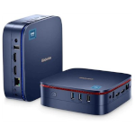
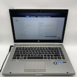

# Personal Streamer TV

# This project is a **work in progress**.

# The following is for development.

## 📺💻 Supported Devices

The TV Streamer is designed to run on a PC, such as a Mini PC, Dell Optiplex, or an old laptop you have lying around.  
In fact, **almost any computer will work** as long as you can install the ISO, connect it to your TV, and control it with an airmouse.

  

The minimum hardware requirements for the Streamer TV have not been determined yet.

> [!WARNING]
> I am not sponsored by, nor affiliated with, any airmouse vendors.  
> I have personally tested the two airmouse models listed below, but **I cannot guarantee the reliability, safety, or trustworthiness** of any vendors linked here.  
> Please research and verify vendors on your own before making a purchase.  
> Most airmouses share similar keyboard layouts, and the Streamer TV is designed to work with any model that provides the standard set of keys.
### Supported Airmouses

The following airmouse models have been tested and confirmed to work:

- **EASYTONE**
- **WeChip W1**  

 

Vendor links (read the above warning first):
- https://www.aliexpress.com/item/1005005245440379.html  
- https://www.amazon.com/dp/B08DFDNZCV?ref=ppx_yo2ov_dt_b_fed_asin_title

## 🧰 How To Setup the Streamer

> [!NOTE]
> The long term goal is to base this streamer on a fork of my **[Easy Arch](https://github.com/devbyte1328/easy-arch-desktop-iso)** distro, which I can modify and use as a template (essentially close to upstream Arch). That project currently has some issues, so we will use Manjaro as a base instead.
> I’m not fully sure whether producing custom Manjaro-based builds is officially supported, and I’m not attempting to automate much at this stage. For now, you’ll have to follow a lot of manual steps to setup the streamer.  
> Once Easy Arch is patched up, I will migrate this project to the new base and automate the setup process.

1. **Download the Manjaro Cinnamon ISO**
   
    Head over to the official Manjaro website and download the Cinnamon edition:
   
    **📥Link: [https://manjaro.org/products/download/x86](https://manjaro.org/products/download/x86)**

2. **Create a Bootable USB**
   
    Use one of the following tools to write the ISO to a USB drive:
    - **[balenaEtcher](https://etcher.balena.io/)** (Windows/macOS/Linux)
    - **[Rufus](https://rufus.ie/en/)** (Windows only)
    - Or use the `dd` command (Linux/macOS):
    ```bash
    sudo dd if=manjaro-cinnamon-25.0.3-250609-linux612.iso of=/dev/sdX bs=4M status=progress && sync
    ```
    
    ⚠️ Replace `/dev/sdX` with your actual USB device (this will erase the disk).
   
    ⚠️ Replace `manjaro-cinnamon-25.0.3-250609-linux612.iso` with the name of the downloaded ISO.

3. **Boot from USB**

    Reboot your machine and use your **BIOS/UEFI boot menu** to boot from the USB drive.  
    When the boot options appear, choose either **"Boot with open-source drivers"** or **"Boot with proprietary drivers."**  
    (As of now, it does not matter which option you select.)

4. **Live Environment and Installation**

    After booting, the ISO will load into a live session. When the **"Manjaro Hello"** window appears, begin the installation by clicking **"Launch Installer"**, located at the bottom center under the **"INSTALLATION"** text label.

    Select your preferred **"language"**, **"location and timezone"** (the streamer displays the time and weather on the home page), and **"keyboard layout"**.

    When you reach the **"Partitions"** step, choose **"Erase disk"** and leave **"Encrypt system"** unchecked.

    In the **"Users"** section, enter **"tv-streamer"** for all three name fields and set the password to **"password"**
    (As of now, password is only used for setup so just use "password" for simplicity.)  
    Make sure to enable both **"Log in automatically"** and **"Use the same password for the administrator account."**

    For the **"Office Suite"** step, select **"No Office Suite."**

    At the **"Summary"** page, click **"Install,"** then confirm with **"Install Now."**  
    Allow Manjaro Cinnamon to complete the installation. When finished, check **"Restart now"** and click **"Done."**
   
5. **First Boot After Installation**

    When the system starts for the first time, the **"Manjaro Hello"** window will appear again.  
    Uncheck "Launch at start" and close the window.
    After closing **"Manjaro Hello"**, a **"Save history"** window will become visible.  
    Click **"No"** to close that window as well.

6. **Run the Setup Script**

    Click the terminal icon in the bottom left corner of the panel.
    Git clone this repository:
    ```bash
    git clone https://github.com/devbyte1328/personal-tv-streamer-iso
    ```
    Navigate into the setup directory:
    ```bash
    cd personal-tv-streamer-iso/setup/
    ```
    Set permissions for **"setup.sh"**:
    ```bash
    sudo chmod +x setup.sh
    ```
    Run **"setup.sh"** with sudo:
    ```bash
    sudo ./setup.sh
    ```
    Allow the setup script to finish before moving onto the manual setup.

7. **Manual Setup**
    Before closing the terminal, generate a **YouTube Data API key**.

    Follow the official YouTube/Google documentation (or lookup a YouTube tutorial video):  
    https://developers.google.com/youtube/registering_an_application

    Once you have your API key, run the following to make it available to the system:
   
    ⚠️ Replace `<your-api-key-here>` with your YouTube Data API key (Don't share this with anyone).
    
    ```
    echo 'export YT_DATA_API_KEY="<your-api-key-here>"' >> ~/.bashrc

    ```
    Reload your shell (optional because the reboot at the end will apply it):
    ```
    source ~/.bashrc
    ```
    
    Configure Firewall Settings:
    Click **"Menu"** → search for **"Firewall"** → open it → enter **"password"** → click **"Enable"**.

    Configure Power Management Settings:
    Click **"Menu"** → search for **"Power Management"** →
    set **"Turn off Screen"** to **"Never"** and set **"Power Button"** to **"Shut Down"**.

    Configure Sleep Mode Settings:
    Click **"Menu"** → search for **"Screensaver"** → set to **"Disable"**.

    Configure Startup Applications:
    Click **"Menu"** → search for **"Startup Applications"** →
    find **"Update Notifier"** → set to **"Disable"**.

    Configure Notifications:
    Click **"Menu"** → search for **"Notifications"** →
    open it → find **"Enable notifications"** → set to **"Disable"**.

    Configure Librewolf Settings:
    Open **"Librewolf"** → click the **hamburger menu** (top-right corner) →
    **"Settings"** → **"Privacy & Security"** →
    scroll to **"Cookies and Site Data"** → disable
    **"Delete cookies and site data when Librewolf is closed"**.
    
    Visit the URL **"about:config"** →
    search for these values and set them accordingly:
    ```
    media.autoplay.default
    ```
    Set **"media.autoplay.default"** → **0**
    ```
    media.autoplay.allow-extension-background-pages
    ```
    Set **"media.autoplay.allow-extension-background-pages"** → **true**
    ```
    media.autoplay.block-webaudio
    ```
    Set **"media.autoplay.block-webaudio"** → **false**
    ```
    media.block-autoplay-until-in-foreground
    ```
    Set **"media.block-autoplay-until-in-foreground"** → **false**
    ```
    media.autoplay.enabled
    ```
    Set **"media.autoplay.enabled"** → **true**
    
    Visit the Tampermonkey Firefox add-on URL: **"https://addons.mozilla.org/en-US/firefox/addon/tampermonkey/"**
    → click **"Add to Firefox"** → click **"Continue to Installation"** → click **"Add"** →
    check **"Pin extention to toolbar"** → click **"OK"** → click on the Tampermonkey icon at the top right cornor of the browser
    → click **"Dashboard"** → click **"⊞ (Create a new script...)"** → paste in the Tampermonkey Javascript from repository
    setup directory **"setup/Tampermonkey.js"** → save with **"CTRL + S"** (or click **"File"**, then **"Save"**).
    
8. **"..."** (Steps to be added...)
    
    ```
    ...
    ```

9. **Reboot**

    Reboot to finalize changes:
    ```bash
    sudo reboot
    ``` 
    
## Credits
- The icons in the **"App"** section of the streamer were sourced and modified. Several of them require attribution under their respective licenses. I have compiled a list of the icon asset origins, which is located at **"/static/assets/asset-origins.txt"**. Link: [https://github.com/devbyte1328/personal-tv-streamer-iso/tree/static/assets/asset-origin.txt](https://github.com/devbyte1328/personal-tv-streamer-iso/blob/main/static/assets/asset-origins.txt)
