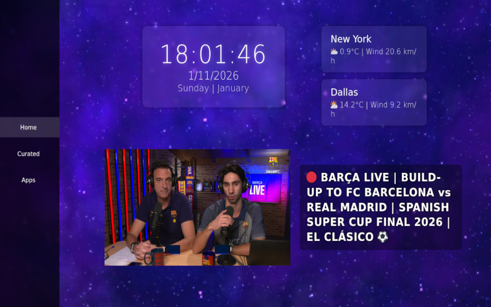
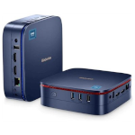
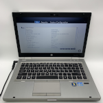
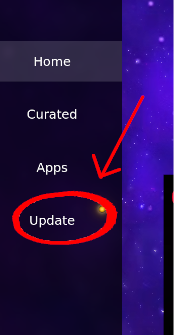

# Personal TV Streamer based on Manjaro.

# This project is a work in progress. this README is currently for development purposes:

## 📖 Description

This project is a TV-style streamer built on top of a lightweight Linux desktop (currently Manjaro Cinnamon).  
It's designed to turn almost any PC into a living room TV streamer, controlled with an airmouse, for accessing streaming services, websites, news, weather, and time.



## 📺💻 Supported Devices

> [!WARNING]
> The minimum hardware requirements for the TV Streamer have not been determined yet.

Almost any computer can be used for the TV Streamer, including Mini PCs, Dell Optiplex systems, and old laptops.  
You only need to install the ISO, connect it to your TV, and use an airmouse for control.

  

> [!WARNING]
> I am not sponsored by or affiliated with any airmouse vendors; while I have tested the models listed below, I cannot guarantee the reliability, safety, or trustworthiness of any linked vendors, so please research before purchasing, as most airmouses share similar layouts and the TV Streamer works with any model that provides the standard keys.

### Supported Airmouses

The following airmouse models have been tested and confirmed to work:

- **EASYTONE**
- **WeChip W1**  

 

Vendor links (read the above warning first):
- https://www.aliexpress.com/item/1005005245440379.html  
- https://www.amazon.com/dp/B08DFDNZCV?ref=ppx_yo2ov_dt_b_fed_asin_title

## 🧰 How to Setup the Streamer

> [!NOTE]
> The long-term goal is to base this streamer on a fork of my **[Easy Arch](https://github.com/devbyte1328/easy-arch-desktop-iso)** distribution, which can be modified and used as a base. However, due to current issues with that project, Manjaro is being used as the base for now. I am not familiar with how to fully setup and automate custom Manjaro builds, so much of the setup must currently be done manually until the project is migrated and automated.

1. **Download the Manjaro Cinnamon ISO**
   
    Head over to the official Manjaro website and download the Cinnamon edition:
   
    **📥Link: [https://manjaro.org/products/download/x86](https://manjaro.org/products/download/x86)**

2. **Create a Bootable USB**
   
    Use one of the following tools to write the ISO to a USB drive:
    - **[balenaEtcher](https://etcher.balena.io/)** (Windows/macOS/Linux)
    - **[Rufus](https://rufus.ie/en/)** (Windows only)
    - Or use the `dd` command (Linux/macOS):
    ```
    sudo dd if=manjaro-cinnamon-25.0.3-250609-linux612.iso of=/dev/sdX bs=4M status=progress && sync
    ```
    
    ⚠️ Replace `/dev/sdX` with your actual USB device (this will erase the disk).
   
    ⚠️ Replace `manjaro-cinnamon-25.0.3-250609-linux612.iso` with the name of the downloaded ISO.

3. **Boot from USB**

    Reboot your machine and use your BIOS/UEFI boot menu to boot from the USB drive.  
    When the boot options appear, press **`Boot with open-source drivers`**.   

4. **Live Environment and Installation**

    After booting, the ISO will load into a live session. When the <ins>*Manjaro Hello*</ins> window appears, begin the installation by clicking **`Launch Installer`**, located at the bottom center under the <ins>*INSTALLATION*</ins> text label.

    Select your preferred <ins>*language*</ins>, <ins>*region*</ins>, <ins>*timezone*</ins> (time is displayed on the home page), and <ins>*keyboard layout*</ins>.

    Check **`Erase disk`**, uncheck **`Encrypt system`**, and click **`Next`**.

    For <ins>*What is your name?*</ins>, <ins>*What name do you want to use to log in?*</ins>, and <ins>*What is the name of this computer?*</ins>, write:
    ```
    tv-streamer
    ```
    For password, write:
    ```
    pass
    ```
    Check **`Log in automatically`**, check **`Use the same password for the administrator account.`**, and click **`Next`**.
    
    Select **`No Office Suite.`**, click **`Next`**, click **`Install`**, and click **`Install Now`**.
    
    When Manjaro Cinnamon completes the installation check **`Restart now`**, and click **`Done`**.
   
5. **First Boot After Installation**

    In the <ins>*Manjaro Hello*</ins> window, uncheck **`Launch at start`**, and close the window.
    In the <ins>*Save history*</ins> window, click **`No`**, and close the window.

6. **First Manual Step**
   
    Generate a <ins>*YouTube Data API v3*</ins> key(follow Google documentation or follow or lookup a YouTube tutorial video).
    
    https://console.developers.google.com
    
    https://developers.google.com/youtube/registering_an_application
    
    https://www.youtube.com/watch?v=XEZYadc2o-8

    Once you have your API key, run the following to make it available to the system:
   
    ⚠️ Replace <ins>*API_GOES_HERE*</ins> with your <ins>*YouTube Data API v3*</ins> key (don't share your API key with anyone).
    
    ```
    echo 'export YT_DATA_API_KEY="API_GOES_HERE"' >> ~/.bashrc
    ```
    
    Reload shell:
    ```
    source ~/.bashrc
    ```

7. **Run the Setup Script**

    Click the terminal icon in the bottom left corner of the panel.
    
    Git clone this repository:
    ```
    git clone https://github.com/devbyte1328/personal-tv-streamer-iso
    ```
    
    Navigate into the setup directory:
    ```
    cd personal-tv-streamer-iso/setup/
    ```
    
    Set permissions for <ins>*setup.sh*</ins>:
    ```
    sudo chmod +x setup.sh
    ```
    
    Run <ins>*setup.sh*</ins> with sudo and your YouTube API key:
    ```
    sudo YT_DATA_API_KEY="$YT_DATA_API_KEY" ./setup.sh
    ```

8. **Manual Setup**
    
    **Configure Firewall Settings:**
    In the Terminal, run Firewall with sudo:
    ```
    sudo gufw
    ```
    Check <ins>*Status*<ins>.

    **Configure Power Management Settings:**
    
    Click <ins>*Menu*</ins>, search for and press <ins>*Power Management*</ins>, set **`Turn off Screen`** to **`Never`**, and set **`Power Button`** to **`Shut Down`**.

    **Configure Sleep Mode Settings:**
    
    Click <ins>*Menu*</ins>, search for and press <ins>*Screensaver*</ins> → set **`Delay before startng the screensaver`** to **`Never`**, and uncheck **`Lock the computer after the screensaver starts`**.

    **Configure Startup Applications:**
    
    Click <ins>*Menu*</ins>, search for and press <ins>*Startup Applications*</ins>, uncheck **`Blueman Applet`**, uncheck **`Clipit`**, uncheck **`Manjaro Hello`**, and uncheck **`MSM Notifier`**.

    **Configure Notifications:**
    
    Click <ins>*Menu*</ins>, search for and press <ins>*Notifications*</ins>, uncheck **`Enable notifications`**.

    **Configure Librewolf Settings:**
    
    Click <ins>*Menu*</ins>, search for and press <ins>*Librewolf*</ins>.
    
    Visit the URL:
    ```
    about:addons
    ```
    
    Check **`Loading Spinner (disabled)`**, click **`Enable`** on the pop up, and click **`Ok`**.
    
    Visit the Tampermonkey Addon URL:
    ```
    https://addons.mozilla.org/en-US/firefox/addon/tampermonkey/
    ```
    
    Click **`Add to Firefox`**, click **`Continue to Installation`**, When install completes, click **`Add`**, check **`Pin extention to toolbar`**, and click **`OK`**, click on the Tampermonkey icon at the top right corner, click **`Dashboard`**, click **`⊞`**(create new script icon) → Copy and paste the content from <ins>*/home/tv-streamer/personal-tv-streamer-iso/setup/Tampermonkey.js*</ins>, save with CTRL+S or click **`File`** and **`Save`**.
    
    Click the hamburger icon (top right corner), click **`Settings`**, **"General"**, scroll to or search for <ins>*Translations*</ins> under the <ins>*General*</ins> section, and uncheck **`Enable fullpage translations`**.

    Scroll to or search for <ins>*DRM*</ins> under the <ins>*General*</ins> section, and check **`Play DRM-controlled content`**.

    Scroll to or search for <ins>*Zoom*</ins> under the <ins>*General*</ins> section, and set **`Default Zoom`** to **`120%`** or adujst based on your screen.
    
    Scroll to or search for <ins>*Delete cookies*</ins> under the <ins>*Privacy & Security*</ins> section, and uncheck **`Delete cookies and site data when Librewolf is closed`**.
    
    Visit the URL:
    ```
    about:config
    ```

    Search for and set to **`0`**:
    ```
    media.autoplay.default
    ```

    Search for and set to **`false`**:
    ```
    media.autoplay.block-webaudio
    ```

    Search for and set to **`false`**:
    ```
    media.block-autoplay-until-in-foreground
    ```

    Search for and set to **`true`**:
    ```
    media.autoplay.enabled
    ```

    Search for and set to **`true`**:
    ```
    toolkit.legacyUserProfileCustomizations.stylesheets
    ```

    Search for and set to **`1`**:
    ```
    browser.link.open_newwindow
    ```

    Search for and set to **`false`**:
    ```
    browser.sessionstore.resume_from_crash
    ```

    Search for and set to **`false`**:
    ```
    browser.sessionstore.restore_on_demand
    ```

    Search for and set to **`0`**:
    ```
    browser.sessionstore.max_resumed_crashes
    ```

10. **Reboot**

    Reboot to finalize changes:
    ```
    sudo reboot
    ``` 
    
## 🖥️📡 How to Setup Update Service/Server

You can configure an update server by adding server information to 'database/serverinfo'.
Once configured, the TV Streamer will check for updates every time it boots up by pinging the server. The update system supports both client-specific updates (targeted to a single TV Streamer) and general updates (applied to all TV Streamers). The TV Streamer sends its "Client Name" and "Build Number". The server evaluates this information and determines whether an update is available. If an update exists, the server notifies the client which makes a "Update" button appear on the left side, highlighted with a glowing yellow indicator to signal its importance. When the user presses the "Update" button, the TV Streamer requests the new files and commands from the server. The server responds by sending does new files and commands. Once received, the TV Streamer applies the new files, runs any commands that were given, and finally reboots to finalize the update.

To have the server send commands for the TV Streamear to execute create a 'update-com.sh' shell script in the payload target user directory.
There should also be a 'update-requirements' file in the payload target user directory that contains a line in the format 'Build: <number>', which represents the minimum required build for the client.

The TV Streamer doesn't start with a Update Service/Server by default, here is how you set one up:
1. **"..."** (Steps to be added...)
    
    ```
    ...
    ```
     
## Credits

### Application Services
- **YouTube Data API** - Used to retrieve video information, thumbnails, titles, and metadata.
- **Open-Meteo Weather API (https://open-meteo.com/)** - Provides all weather and forecast data.

### System & Platform
- **Manjaro Linux (Cinnamon Edition)** - The application runs on Manjaro Cinnamon and uses the local system clock/time services for real-time clock updates.
- **Network Time Protocol (NTP)** - System time is synchronized via the operating system’s configured NTP sources (typically pool.ntp.org or Manjaro/Arch Linux regional time servers).

### Assets & Icons
- Several icons used in the **"App"** section of the streamer interface are sourced and modified from third-party creators.  
  A full list of original icon sources and licenses is maintained at:  
  **`/static/assets/asset-origins.txt`**  
  GitHub link:  
  https://github.com/devbyte1328/personal-tv-streamer-iso/blob/main/static/assets/asset-origins.txt
